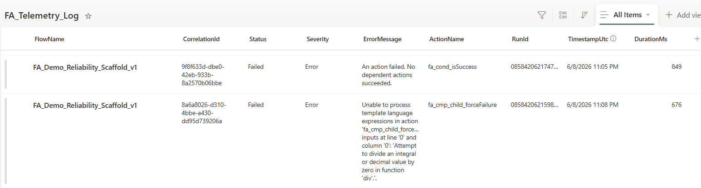
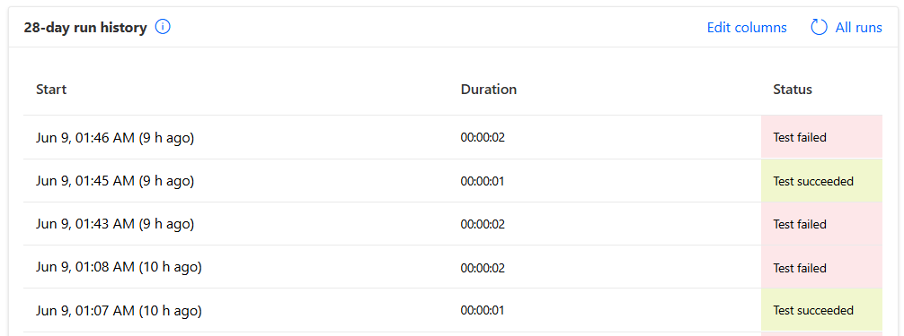

# FlowArmor – Reliability Framework for Power Automate
> ✅ Eliminates silent failures and enables traceable, production


FlowArmor standardizes error handling, telemetry, correlation tracking, and failure propagation for Power Automate to eliminate silent failures and improve operational visibility.


---

## 🚀 Get Started

**Download the latest Power Platform solution package (ZIP):**

[](https://github.com/spashikanti/flowarmor-core/releases/latest)
[](https://github.com/spashikanti/flowarmor-core/releases/latest)
[](https://github.com/spashikanti/flowarmor-core/releases)


---

## 📊 Outcomes at a Glance

| Scenario | Without FlowArmor | With FlowArmor |
|----------|------------------|----------------|
| **Failure Visibility** | ❌ Hidden (False Greens) | ✅ Explicit (Accurate Run History) |
| **Error Structure** | ❌ Inconsistent / Raw Strings | ✅ Standardized JSON Schema |
| **Debugging Process** | ❌ Manual Deep-Diving | ✅ Correlation-Id Tracing |
| **Logging Strategy** | ❌ Ad-Hoc / Scattered | ✅ Structured / Hybrid Storage |
| **Observability** | ❌ Limited to Single Runs | ✅ Scalable Enterprise Sinks |


---

## 🎯 Why FlowArmor Exists


Power Automate provides incredibly flexible building blocks for cloud automation, but it does not prescribe a standardized approach for:

*   Error handling structures    
*   Inter-flow failure propagation    
*   Distributed correlation tracking    
*   Standardized telemetry generation
    

As organizations scale from a handful of isolated flows to hundreds of business-critical, interconnected automations, inconsistent implementation patterns create severe operational blind spots. FlowArmor provides a reusable, lightweight framework that standardizes these concerns at the workflow layer without forcing a lock-in on where that telemetry must ultimately be stored or consumed.

---

## ⚠️ What FlowArmor Is Not


To establish clear architectural boundaries, FlowArmor is **not**:

*   **A replacement for Azure Monitor or Application Insights:** It is the application-layer telemetry _generator_ that feeds them.
    
*   **A replacement for the Power Platform CoE Starter Kit:** The CoE Kit excels at macro-level inventory and environment governance; FlowArmor focuses on micro-level transactional reliability within individual workflows.
    

Instead, FlowArmor acts as the missing standardized reliability layer that sits inside your flows to cleanly bridge the gap between platform runtimes and enterprise monitoring suites.

---

## 🚨 The Enterprise Problem


Real-world Power Automate implementations consistently face operational visibility gaps:

*   ❌ **Silent Failures:** Flows show a green Succeeded status in run history even when internal business or system logic fails.
    
*   ❌ **Inconsistent Schemas:** Error payloads return in unpredictable types (sometimes arrays, objects, or raw strings).
    
*   ❌ **Operational Data Silos:** Error details are locked inside individual run histories, making environment-wide debugging time-consuming.
    
*   ❌ **Unpredictable Alerts:** In-flow email alerts trigger "alert storms" during high-volume API outages.
    
---

## ✅ The FlowArmor Solution


FlowArmor enforces a highly reliable, structured pattern for enterprise workflow development by focusing on four key pillars:

*   🛡️ **Failure Propagation (Fail-Fast Mode):** Enables child flows to explicitly propagate failures back to parent orchestrations, ensuring parent execution maps accurately instead of swallowing errors.
    
*   🔄 **Telemetry Normalization:** Produces a standardized, predictable JSON telemetry contract regardless of whether the raw downstream error was a complex API object or a basic string.
    
*   🔗 **Correlation Tracking:** Implements distributed tracing by passing a unified CorrelationId seamlessly across parent and child execution chains.
    
*   🔌 **Decoupled Logging:** Flushes logs to external sinks asynchronously, keeping the core business execution loop lightweight and protected from API throttling.

---

## 🌍 Community Impact

FlowArmor provides a reusable and standardized foundation for Power Automate reliability patterns, helping developers and organizations:

- Reduce debugging time through consistent telemetry
- Eliminate hidden failures in production workflows
- Improve operational visibility across distributed flows

---


## 🚀 Quick Start


1.  **Import:** Download and import the FlowArmor solution zip into your target Power Platform environment.
    
2.  **Provision Storage:** Create the `FA_Telemetry_Log` SharePoint list (see **Setup & Deployment Guide** section below for schema).
    
3.  **Configure:** Set the environment variables `fa_env_sp_siteUrl` and `fa_env_sp_listName` to point to your new list.
    
4.  **Test:** Turn on and run `FA_Demo_Reliability_Scaffold_v1` to validate the baseline scaffolding and watch it handle a forced error.
    
5.  **Verify:** Check your SharePoint list to see the normalized telemetry payload.

---

## 🖼️ Sample Output

### ✅ SharePoint Telemetry Log



### ✅ Flow Run Results (No Silent Failures)



---

## 🧭 Architecture & Data Lifecycle

```text
[ SCOPE: TRY ] --------> (On Failure) --------> [ SCOPE: CATCH ]
              |                                             |
       Business Logic                              Normalize Error
              |                                  Set varFailedFlag = true
              v                                             v
       -----------------------------------------------------------------------
                              [ SCOPE: FINALLY ]
                       Flush Standardized Telemetry JSON
                                      |
                                      v
                        [ CONDITIONAL OUTCOME CHECK ]
                                      |
                 +--------------------+--------------------+
                 v                                         v
        (varFailedFlag == true)                 (Default)
        [ TERMINATE: FAILED ]                 [ NATURAL SUCCESS ]
  (FlowArmor.BusinessFailure)               (Green Run History)
```

> ⚠️ **Critical Configuration Note:** For the CATCH scope to intercept failures from the TRY scope, you must manually configure its **"Run After"** settings. Ensure CATCH is set to run **only** if TRY _has failed, is skipped, or has timed out_.

---

## 🎯 Real-World Use Cases


*   **Parent-Child Orchestrations:** Trace a single transaction completely across nested child execution chains without losing the core execution context.
    
*   **Mission-Critical API Integrations:** Wrap brittle HTTP actions to capture precise downstream API fault payloads cleanly without causing unhandled flow crashes.
    
*   **Enterprise Support Auditing:** Centralize multi-environment error records into a single repository for support desk triage visibility.

---

## 🔌 Supported Telemetry Targets


*   **Current (v1.0):** SharePoint List (Hybrid Indexed/JSON Model)
    
*   **Planned (v1.1):** Microsoft Dataverse Native Log Tables
    
*   **Planned (v2.0):** Azure Application Insights & Azure Monitor Integration

---

## 📦 Solution Contents


*   **Cloud Flows:**
    
    *   `FA_Demo_Reliability_Scaffold_v1` (The Parent template pattern)
        
    *   `FA_Child_Process_Sample_v1` (The Child template pattern)
        
*   **Environment Variables:**
    
    *   `fa_env_sp_siteUrl` (Target logging site)
        
    *   `fa_env_sp_listName` (Target logging list)
        
*   **Data Sinks:**
    
    *   `FA_Telemetry_Log` (SharePoint List Deployment Blueprint)
        
---

## ⚙️ Setup & Deployment Guide


### Provision the Storage Sink

Create a SharePoint list named `FA_Telemetry_Log` with the following columns:

| Column Name     | Type                                 | Purpose |
|----------------|--------------------------------------|--------|
| Title          | Single Line of Text                  | Stores Flow Name |
| CorrelationId  | Single Line of Text                  | Tracking key for distributed tracing |
| Status         | Choice (`Success`, `Failed`)         | Execution outcome |
| Severity       | Choice (`Info`, `Warning`, `Error`) | Log priority |
| ActionName     | Single Line of Text                  | Failing action identification |
| ErrorMessage   | Multiple Lines of Text               | Captured error message |
| RunId          | Single Line of Text                  | Flow run identifier |
| TimestampUtc   | Date and Time                        | Execution timestamp |
| DurationMs     | Number                               | Execution duration |

> ℹ️ **Design Note:**
> This version of FlowArmor uses a structured column-based logging model for readability. Future versions will support a hybrid model with raw JSON telemetry for advanced analytics and extensibility.

---

## 🧪 Standardized Telemetry Schema


The framework natively constructs and emits a structured telemetry contract to the configured logging sink.

*   **On Success:** The errorDetails object defaults to null.
    
*   **On Failure:** The payload populates the failing action, error message, and raw body:
    

JSON

```json
{
  "flowName": "FA_Demo_Reliability_Scaffold_v1",
  "status": "Failed",
  "correlationId": "12345-abc-98765-xyz",
  "severity": "Error",
  "runId": "0858493029485736251434",
  "timestampUtc": "2026-06-09T07:15:00Z",
  "errorDetails": {
    "actionName": "fa_cmp_child_forceFailure",
    "errorMessage": "Attempt to divide by zero",
    "rawPayload": {}
  }
}
```

---

## 🧱 Architectural Design Principles


FlowArmor enforces strict **Separation of Concerns (SoC)** based on modern ITIL 4 Event Management practices:

*   **The Generation Principle:** The workflow's job is solely to capture, format, and emit standard telemetry.
    
*   **The Consumption Principle:** External systems consume the telemetry asynchronously. The core execution loop never handles alerting logic directly (preventing notification spam and API throttling).

---

### ⚠️ Important Design Rule: Child Flow Behavior

In FlowArmor, child flows are designed to **always return a response to the parent flow**, even when an error occurs.

- Child flows capture and normalize errors internally  
- They return structured telemetry instead of failing abruptly  
- The parent flow determines the final outcome using `varHasFailure`

✅ This ensures:
- Complete telemetry capture  
- Consistent failure handling  
- Proper parent-level failure signaling  

> The parent flow is the single source of truth for final execution status.

---

## 📈 Telemetry Maturity Model


FlowArmor adapts seamlessly to your enterprise infrastructure scale without requiring modifications to your core application code:

| Tier    | Model                | Description |
|---------|---------------------|------------|
| Tier 1  | Transactional Audit | Logs to SharePoint/Dataverse for manual inspection |
| Tier 2  | Proactive Alerts    | Central flow processes logs and triggers controlled alerts |
| Tier 3  | Full Observability  | Integration with Application Insights, KQL, dashboards |

---

## 🛣️ Roadmap


### v1.0 (Current)

*   Core structural reliability scaffold (TRY/CATCH/FINALLY)
    
*   Standardized JSON telemetry contract normalization
    
*   Hybrid decoupled SharePoint logging sink
    

### v1.1

*   Native Microsoft Dataverse logging provider
    
*   Extended schema parameters for environment metadata
    

### v2.0 (Enterprise Observability Pack)

*   Direct Azure Application Insights routing integration
    
*   Azure Monitor native telemetry mapping
    
*   KQL query cookbook for proactive log alerting
    

### v2.1

*   Pre-built Power BI monitoring templates
    
*   Centralized operations dashboard pack
    
---

## 🤝 Contributing


Contributions, issue tracking, and architectural suggestions are welcome! Please submit a pull request or open an issue in the project repository.

---

## 📜 License


Distributed under the MIT License. See [LICENSE](./LICENSE) for more information.


